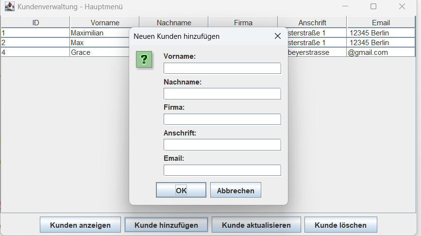

# 🖥️ Kundenverwaltung – Customer Management System

  

---

## 🇩🇪 Beschreibung

Kundenverwaltung ist eine **Java Desktop-Anwendung** zur Verwaltung von Kundeninformationen.  
Die Anwendung ermöglicht das **Anlegen, Bearbeiten, Löschen und Auflisten von Kunden**.  
Admin-Benutzer haben erweiterte Rechte, wie das Löschen von Kunden.

## 🇬🇧 Description

Kundenverwaltung is a **Java desktop application** for managing customer information.  
The application allows **adding, editing, deleting, and listing customers**.  
Admin users have extended rights, such as deleting customers.

---

## 🇩🇪 Features

- Benutzer-Login mit Rollen (Admin / Mitarbeiter)
- Kunden erstellen, bearbeiten, löschen
- Kunden in einer Tabelle anzeigen
- Lösch-Funktion nur für Admin-Benutzer
- Eingaben über einfache Popups (JOptionPane)
- Verbindung zu MariaDB-Datenbank für persistente Daten

## 🇬🇧 Features

- User login with roles (admin / employee)
- Add, edit, delete customers
- Display customers in a table
- Delete function only visible for admin
- Simple popups for input (JOptionPane)
- Persistent data via MariaDB database

---

## 🇩🇪 Installation & Nutzung

1. MariaDB installieren und die Datenbank **kundenverwaltung** erstellen.
2. Tabellen **mitarbeiter** und **kunden** gemäß Schema anlegen.
3. Projekt in **IntelliJ IDEA** importieren (Java 17 empfohlen).
4. **DBConnection.java** mit den eigenen Datenbankzugangsdaten konfigurieren.
5. **KundenGUI.java** starten, um das Login-Fenster zu öffnen.

## 🇬🇧 Installation & Usage

1. Install MariaDB and create the **kundenverwaltung** database.
2. Create tables **mitarbeiter** and **kunden** according to the schema.
3. Import the project in **IntelliJ IDEA** (Java 17 recommended).
4. Configure **DBConnection.java** with your database credentials.
5. Run **KundenGUI.java** to open the login window.

---

## 🇩🇪 Konsole-Version

Das Projekt enthält auch **Main.java**, die die Kundenverwaltung **im Konsolenmodus** ausführen kann.
- Starten Sie `Main.java` in der IDE oder über die Konsole.
- Benutzer können Kunden erstellen, bearbeiten, löschen und auflisten.
- Admin-Benutzer haben weiterhin volle Rechte.

## 🇬🇧 Console Version

The project also includes **Main.java**, which runs the customer management system **in console mode**.
- Run `Main.java` in your IDE or from the terminal.
- Users can add, edit, delete, and list customers.
- Admin users still have full privileges.

---

## 🇩🇪 Datenbank-Schema

### mitarbeiter
| id | username | password | role |

### kunden
| id | vorname | nachname | firma | anschrift | email |

## 🇬🇧 Database Schema

### employees
| id | username | password | role |

### customers
| id | firstname | lastname | company | address | email |

---

## Screenshots

Main Window:  

Login Window:  

---

## 🇩🇪 Lizenz

Dieses Projekt steht unter der **MIT-Lizenz**.

## 🇬🇧 License

This project is licensed under the **MIT License**.
